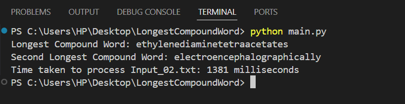

# Word-Composition-Problem_Impledge-Technologies
Coding Project Round Submission

# Overview
This project solves the Word Composition Problem where we identify the longest compounded word and the second-longest compounded word from a list of alphabetically sorted words. A compounded word is a word that can be formed by concatenating smaller words from the list.

# Problem Requirements
Input: Two input files (Input_01.txt and Input_02.txt) containing alphabetically sorted words.
Output:
Longest compounded word
Second longest compounded word
Time taken to process the file

# Sample Output
For Input_01.txt:

For Input_02.txt:

# Solution Approach
Data Structure Used:
A Trie is employed for efficient word lookups and to check if a word is compounded by smaller words. This allows for fast prefix searching and reduces time complexity compared to brute-force methods.

Steps in the Program:
Read the input word files.
Insert each word into a Trie for efficient search.
For each word, check if it can be constructed by combining smaller words found in the Trie.
Track the longest and second-longest compounded words.
Measure the time taken to process the file.

# How to Run
Clone the repository:
git clone https://github.com/arpit8723/Word-Composition-Problem_Impledge-Technologies.git

Navigate to the project directory:
cd Word-Composition-Problem_Impledge-Technologies

Run the program using Python:
python main.py

*Ensure you have Python 3.x installed.*

# Files
main.py: Main program file that implements the solution using a Trie.
Input_01.txt & Input_02.txt: Input files with word lists.
output.log: Logs the results (longest compounded words, processing time).

# Key Design Decisions
Trie Usage: The Trie data structure was selected for efficient word lookups. By storing words in a Trie, we avoid redundant checks and significantly speed up the process of finding compounded words.

Time Efficiency: The program efficiently handles large input files (100,000+ words) by using the Trie for constant-time lookups instead of nested iterations through the word list.
